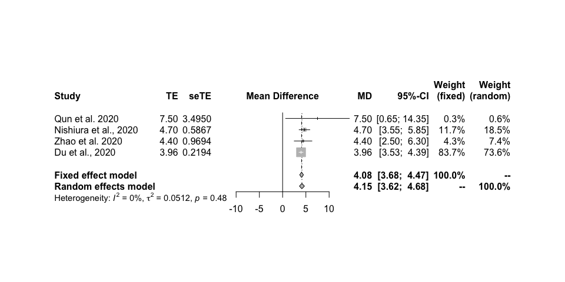

<!-- README.md is generated from README.Rmd. Please edit that file -->

# covid-19-indicators

Epidemiological Indicators of COVID-19. If you would like to add
information, have ideas or found a mistake, send a PR or open an issue.

## [Case Fatality Rate](https://en.wikipedia.org/wiki/Case_fatality_rate)

| Point Estimate | Uncertainty Interval     | N  | Place                          | Time                           | Age Group | Published  | Reference                                                                                                                                                                              |
| :------------- | :----------------------- | :- | :----------------------------- | :----------------------------- | :-------- | :--------- | :------------------------------------------------------------------------------------------------------------------------------------------------------------------------------------- |
| 5.25%          | (95% CI: 4.98%-5.51%)    | NA | Wuhan City                     | January 10 to February 3, 2020 | NA        | 2020-03-10 | [(Yang et al., 2020), Ann Transl Med.](https://www.ncbi.nlm.nih.gov/pubmed/32168464)                                                                                                   |
| 1.41%          | (95% CI: 1.38%-1.45%)    | NA | Mainland China excluding Hubei | January 10 to February 3, 2020 | NA        | 2020-03-10 | [(Yang et al., 2020), Ann Transl Med.](https://www.ncbi.nlm.nih.gov/pubmed/32168464)                                                                                                   |
| 0.15%          | (95% CI: 0.12%-0.18%)    | NA | Mainland China excluding Hubei | January 10 to February 3, 2020 | NA        | 2020-03-10 | [(Yang et al., 2020), Ann Transl Med.](https://www.ncbi.nlm.nih.gov/pubmed/32168464)                                                                                                   |
| 2.30%          | (95% CI: 0.75%-5.30%)    | NA | Diamond Princess cruise ship   | NA                             | NA        | 2020-03-05 | [(Russel et al., 2020), LSHTM](https://cmmid.github.io/topics/covid19/severity/diamond_cruise_cfr_estimates.html)                                                                      |
| 18.00%         | (95% CI: 7.30%-33.00%)   | NA | Diamond Princess cruise ship   | NA                             | 70+       | 2020-03-05 | [(Russel et al., 2020), LSHTM](https://cmmid.github.io/topics/covid19/severity/diamond_cruise_cfr_estimates.html)                                                                      |
| 18.00%         | (95% CrI: 11.00%-81.00%) | NA | China, Hubai                   | NA                             | NA        | 2020-02-10 | [Imperial College London COVID-19 Response Team](https://www.imperial.ac.uk/media/imperial-college/medicine/sph/ide/gida-fellowships/Imperial-College-COVID19-severity-10-02-2020.pdf) |

## [Incubation Period](https://en.wikipedia.org/wiki/Incubation_period)

| Estimate in Days | Type           | Uncertainty Interval |   N | Place/Time                                                                 | Published  | Reference                                                                             |
| ---------------: | -------------- | -------------------- | --: | -------------------------------------------------------------------------- | ---------- | ------------------------------------------------------------------------------------- |
|              5.1 | Median         | (95% CI: 4.5-5.8)    | 181 | Persons with confirmed SARS-CoV-2 infection outside Hubei province, China. | 2020-03-10 | [(Lauer et al., 2020), Ann Intern Med.](https://www.ncbi.nlm.nih.gov/pubmed/32150748) |
|             11.5 | 97.5% quantile | (95% CI: 8.2-15.6)   | 181 | Persons with confirmed SARS-CoV-2 infection outside Hubei province, China. | 2020-03-10 | [(Lauer et al., 2020), Ann Intern Med.](https://www.ncbi.nlm.nih.gov/pubmed/32150748) |
|              5.0 | Mean           | (95% CrI: 4.2-6.0)   |  52 | China?, excluding Wuhan residents                                          | 2020-02-17 | [(Linton et al., 2020), J. Clin. Med..](https://www.mdpi.com/2077-0383/9/2/538)       |
|              5.6 | Mean           | (95% CrI: 5.0-6.3)   | 158 | China?, including Wuhan residents                                          | 2020-02-17 | [(Linton et al., 2020), J. Clin. Med..](https://www.mdpi.com/2077-0383/9/2/538)       |
|              5.2 | Mean           | (95% CI: 4.1-7.0)    | 425 | Wuhan, Hubei Province, China, in December 2019 and January 2020            | 2020-01-29 | [(Qun et al., 2020), NEJM](https://www.nejm.org/doi/full/10.1056/NEJMoa2001316)       |
|             12.5 | 95% quantile   | (95% CI: 4.1-7.0)    | 425 | Wuhan, Hubei Province, China, in December 2019 and January 2020            | 2020-01-29 | [(Qun et al., 2020), NEJM](https://www.nejm.org/doi/full/10.1056/NEJMoa2001316)       |

## [Serial Interval](https://en.wikipedia.org/wiki/Serial_interval)

  - “\[…\] 12.6% of the serial intervals in our sample were negative.”
    [Ref](https://doi.org/10.3201/eid2606.200357). Models need to
    account for negative serial intervals.

| Estimate in Days | Type   | Uncertainty Interval |   N | Place/Time                                                                  | Published  | Reference                                                                                                  |
| ---------------: | ------ | -------------------- | --: | --------------------------------------------------------------------------- | ---------- | ---------------------------------------------------------------------------------------------------------- |
|             3.96 | Mean   | (95% CI: 3.53-4.39)  | 468 | Mainland China outside of Hubei Province during January 21–February 8, 2020 | 2020-03-19 | [(Du et al., 2020), Emerging Infectious Diseases](https://doi.org/10.3201/eid2606.200357)                  |
|             4.75 | SD     | (95% CI: 4.46-5.07)  | 468 | Mainland China outside of Hubei Province during January 21–February 8, 2020 | 2020-03-19 | [(Du et al., 2020), Emerging Infectious Diseases](https://doi.org/10.3201/eid2606.200357)                  |
|              4.6 | Median | (95% CrI: 3.5-5.9)   |  18 | ?                                                                           | 2020-03-02 | [(Nishiura et al., 2020), Int J Infect Dis.](https://www.ncbi.nlm.nih.gov/pubmed/32145466)                 |
|              4.4 | Mean   | (95% CI: 2.9−6.7)    |  21 | Hong Kong from January 16 to February 15, 2020                              | 2020-02-25 | [(Zhao et al., 2020), medrxiv](https://www.medrxiv.org/content/10.1101/2020.02.21.20026559v1.article-info) |
|              7.5 | Mean   | (95% CI: 5.3-19)     | 425 | Wuhan, Hubei Province, China, in December 2019 and January 2020             | 2020-01-29 | [(Qun et al., 2020), NEJM](https://www.nejm.org/doi/full/10.1056/NEJMoa2001316)                            |

### Pooled Mean

I used the `meta` package to pool the various reported means of the
serial interval. Please be careful as this might not be the right way to
pool means of serial intervals. But it is something. If you have any
suggestions leave an issue.

<!-- -->

## WHO Publication Database

The WHO maintains a database of all COVID-19 related studies. This is a
good starting point if you want to contribute instead of text searches
on pubmed (what I did in the beginning).

  - <https://www.who.int/emergencies/diseases/novel-coronavirus-2019/global-research-on-novel-coronavirus-2019-ncov>
